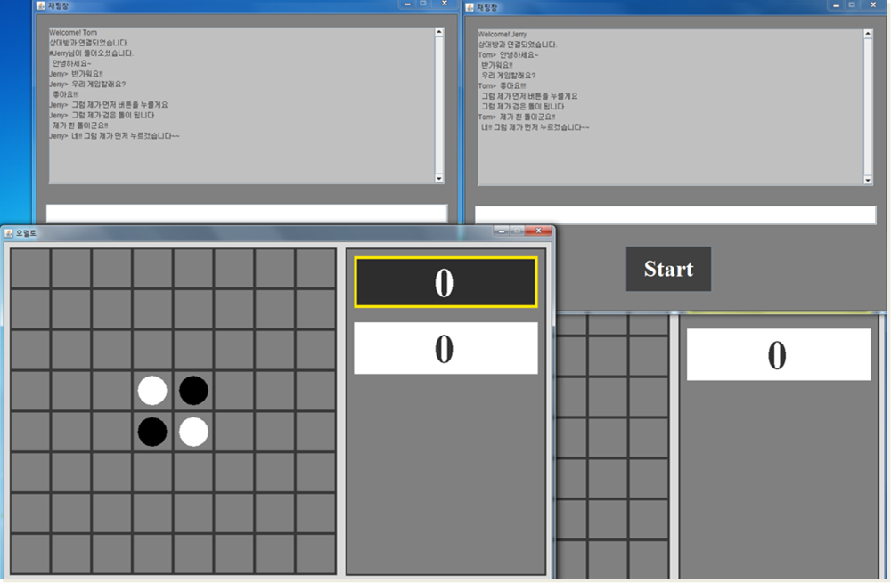

# Project-TCP-IP
This project is for practicing to write **server program in Go language**.

This is based on one of my program that I made when I was at university in Jan, 2014.

I wrote some implementation issues in my Gitbook workspace. [Here](https://kuongee.gitbook.io/workspace/interests/gostudy/2018-03-08-goserver)

## Server program
The server runs for delivering the messages between clients.  
There are Java and Go lang versions.

## Client program
Written in Java

What clients can do:
  - Chatting (with other clients)
  - Othello game (with another client)

### Author
Jeesoo Min (kuongee@gmail.com)
